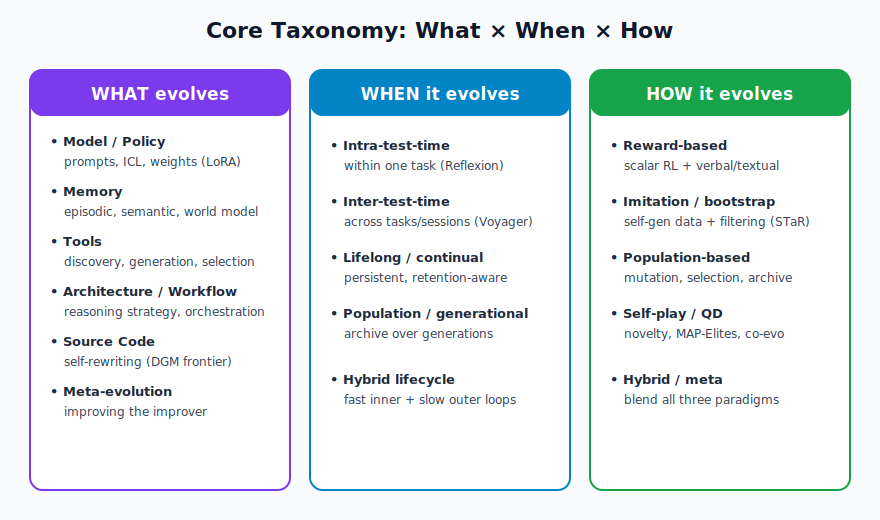
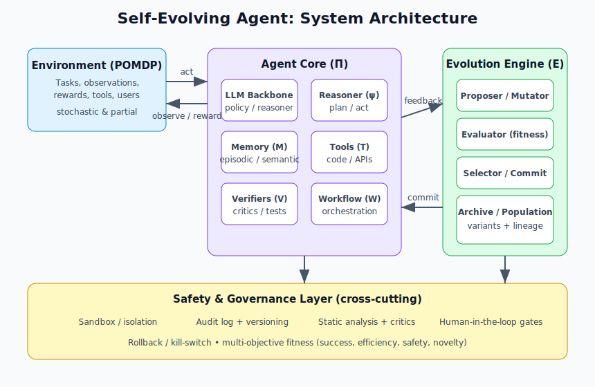
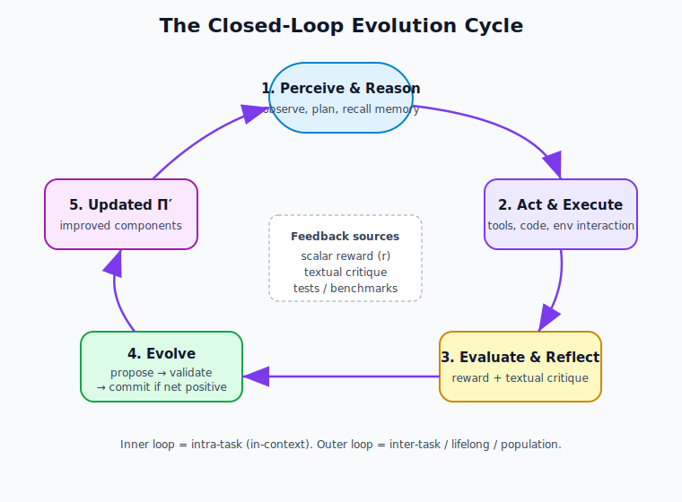
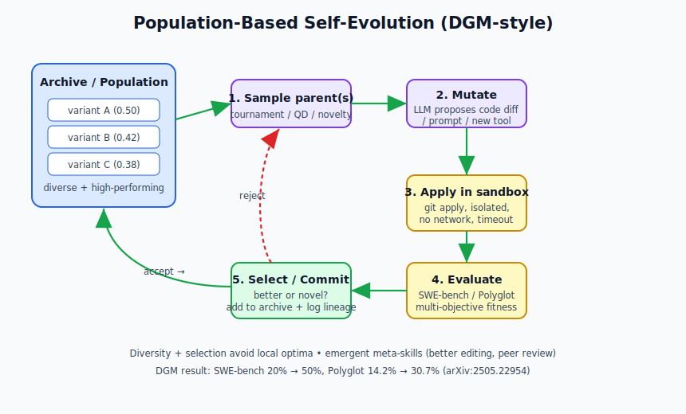
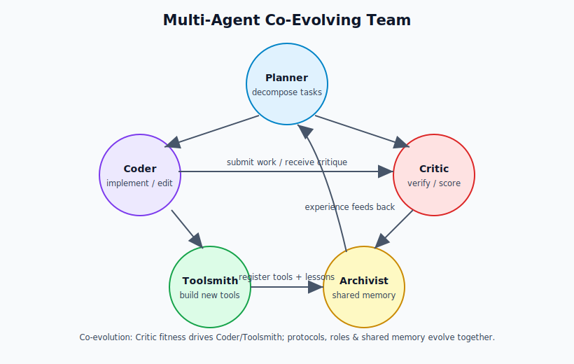

# 自我進化代理：從基礎到自主智慧

## 一本以研究為本、注重實作的指南，教你打造持續自我改進的 AI 系統

**版本 1.0 | 2026 年 6 月**

> *本書綜合 2025–2026 年 arXiv 上的綜述與系統研究，包括 [自我進化代理綜述（Gao 等人，arXiv:2507.21046）](https://arxiv.org/abs/2507.21046)、[連結基礎模型與終身代理系統的新範式（Fang 等人，arXiv:2508.07407）](https://arxiv.org/abs/2508.07407)、[達爾文哥德爾機（Zhang 等人，arXiv:2505.22954）](https://arxiv.org/abs/2505.22954)，以及關於遞迴自我改進、[Reflexion](https://arxiv.org/abs/2303.11366)、[Voyager](https://arxiv.org/abs/2305.16291) 和開放式進化的相關著作。本書提供第一原理解釋、分類體系、逐步實作、可重現程式碼、實際應用，以及安全、可投入生產之部署的指引。*

---

## 如何閱讀本書

本書從**理論到實務**分為四個階段：

1. **基礎（第 1–3 章）：** 什麼是自我進化代理、它們從何而來，以及支配它們的第一原理。
2. **分類體系（第 4–6 章）：** 圍繞**進化什麼（What）**、**何時進化（When）**、**如何進化（How）** 建立的精確心智模型。
3. **實作（第 7–9 章）：** 可運作的程式碼——從反思模組到完整的群體式自我進化編碼代理——以及如何與框架整合。
4. **營運（第 10–14 章）：** 評估、實際應用、安全、未解難題，以及你前進的路線圖。

每一章都會交叉引用其他章節（例如「見 §6.3」），並整合儲存在 [`diagrams/`](diagrams/) 中的 SVG **架構圖**。每篇引用的論文都連結到其 arXiv 摘要。程式碼區塊皆可重現；[第 8 章](#第-8-章逐步教學建構自我進化的編碼代理簡化版-dgm-風格) 的完整教學會建立一個可執行的系統。

---

## 目錄

1. [導論：什麼是自我進化代理？為何重要？](#第-1-章導論什麼是自我進化代理為何重要)
2. [歷史背景與 AI 自我改進的演進](#第-2-章歷史背景與-ai-自我改進的演進)
3. [第一原理與核心設計原則](#第-3-章第一原理與核心設計原則)
4. [分類體系（一）：進化什麼](#第-4-章分類體系一進化什麼)
5. [分類體系（二）：何時進化](#第-5-章分類體系二何時進化時機與生命週期)
6. [分類體系（三）：如何進化](#第-6-章分類體系三如何進化機制與演算法)
7. [構件：以程式碼實作核心元件](#第-7-章構件以程式碼實作核心元件)
8. [逐步教學：建構自我進化的編碼代理](#第-8-章逐步教學建構自我進化的編碼代理簡化版-dgm-風格)
9. [進階架構、多代理系統與框架](#第-9-章進階架構多代理系統與框架)
10. [評估、基準、指標與持續評量](#第-10-章評估基準指標與持續評量)
11. [實際應用與使用案例](#第-11-章實際應用與使用案例)
12. [安全、對齊、風險與緩解策略](#第-12-章安全對齊風險與緩解策略)
13. [挑戰、限制與開放研究前沿](#第-13-章挑戰限制與開放研究前沿)
14. [結論與如何開始](#第-14-章結論與如何開始)

**附錄**
- [A. 關鍵術語表](#附錄-a術語表)
- [B. 里程碑論文與系統](#附錄-b里程碑論文與系統)
- [C. 推薦工具與函式庫](#附錄-c推薦工具與函式庫)
- [D. 設定範本與最佳實務](#附錄-d設定範本與最佳實務)
- [E. 參考文獻](#附錄-e參考文獻)

---

## 第 1 章：導論：什麼是自我進化代理？為何重要？

### 1.1 定義自我進化代理

大型語言模型（LLM）以其出色的零樣本與少樣本能力改變了 AI。然而它們本質上是**靜態的**：訓練後參數即被凍結，當面對新穎任務、變動環境或長程目標時，無法自主調整其內部知識、推理策略、工具或程式碼。

**自我進化代理**代表一種範式轉變。它們是動態的代理式系統，能夠透過與環境互動、回饋（純量獎勵或文字評語）、自我反思、經驗累積，以及——關鍵在於——修改自身元件，來進行**持續、自主的適應**。這些元件包括提示詞、記憶結構、工具集、工作流程、推理架構，以及在進階情況下的自身原始碼。

Gao 等人的基礎綜述（[arXiv:2507.21046](https://arxiv.org/abs/2507.21046)）將此領域定義為：一個能持續從新資料、互動與經驗中學習的系統，產生更穩健、更通用、更能處理複雜動態問題的系統，最終為通往人工超智慧（ASI）提供一條路徑。*（為符合授權規範，此處為改寫摘要，詳見原始出處。）*

與傳統代理（例如把 ReAct 或原版 Reflexion 當作固定框架使用）的關鍵差異：

- **傳統代理**執行由人類設計的固定迴圈或策略。
- **自我進化代理**會隨時間透過閉環自主性，改進其*策略、元件，乃至進化過程本身*。

自我進化沿著**三個正交維度**運作——這是此領域的核心分類體系，如下圖所示，並在第 [4](#第-4-章分類體系一進化什麼)–[6](#第-6-章分類體系三如何進化機制與演算法) 章詳述：

- **進化什麼（What）：** 模型（權重／提示詞）、記憶、工具、架構／工作流程，或代理自身的程式碼。
- **何時進化（When）：** 測試時內（單一任務／回合內）、測試時間（跨任務／回合），或終身／持續（具保留機制的長期持久適應）。
- **如何進化（How）：** 透過獎勵訊號（文字回饋、純量 RL）、模仿／自我引導，或群體式方法（演化演算法、自我對弈、共同進化、變體存檔）。



*圖 1.1 — 組織此領域的三軸分類體系。詳見[第 4 章](#第-4-章分類體系一進化什麼)起。*

### 1.2 為何需要自我進化代理？靜態系統的限制

靜態 LLM 與代理面臨：

- **在開放式環境中的脆弱性：** 它們在需要適應的新穎分布或長程任務上失敗（不斷變動的程式庫、動態網頁環境、長達數月的個人化輔導）。
- **缺乏終身學習：** 每個工作階段都從頭開始，或依賴人工策劃的檢索增強生成（RAG）或微調。
- **人力瓶頸：** 每一次改進都需要工程師診斷失敗、策劃資料、重新訓練，或重新設計提示詞與工作流程。
- **效能停滯：** 缺乏開放式探索與自我修改機制時，代理很快就陷入局部最佳。

自我進化代理透過以下方式解決這些問題：

- **自主改進迴圈：** 代理提出變更 → 評估變更（基準、環境回饋、評論者）→ 採納有益者 → 重複。
- **開放式：** 發現新策略、新工具，甚至改進的元策略（改進「改進者」本身）。
- **通往 ASI 的路徑：** 隨運算與經驗（而非純人力工程）擴展的累積、複利式智慧增長。

具體動機：

- 一個編碼代理不僅能解決 [SWE-bench](https://www.swebench.com/) 任務，還能重寫自己的工具使用程式碼、反思機制與長上下文處理，使成功率隨時間攀升——如達爾文哥德爾機在 SWE-bench 上從約 **20% 提升到 50%**（[arXiv:2505.22954](https://arxiv.org/abs/2505.22954)）。
- 一個教育輔導代理在整個學期中，調整其教學策略、對學生迷思概念的記憶，以及課程生成。
- 一個交易或研究代理在真實情境中演化其策略、資料來源與風險模型。
- 多代理系統（用於軟體團隊或研究）共同進化其協調協定。

### 1.3 本書的範圍與目標

本書**注重實務與教學**。它使你能夠：

- 理解理論基礎與最新研究（2025–2026）。
- 從零開始設計與實作自我進化代理，或擴充既有框架（LangGraph、AutoGen、CrewAI、LlamaIndex 或自訂框架）。
- 建立可重現的程式碼，包括受 [Reflexion](https://arxiv.org/abs/2303.11366)、[Self-Refine](https://arxiv.org/abs/2303.17651)、[Voyager](https://arxiv.org/abs/2305.16291)、[達爾文哥德爾機（DGM）](https://arxiv.org/abs/2505.22954) 等啟發的簡化版本。
- 評估、除錯並安全部署這類系統。
- 將它們應用於軟體工程、教育、金融、內容創作與自動化。
- 駕馭風險、安全與倫理議題。

**先備知識：** 基本 Python、LLM API 使用（OpenAI 相容或 xAI），以及對代理概念（工具、ReAct、記憶）的熟悉。不需要進階 ML 理論；我們從第一原理建立。

我們全程強調**生產考量**：程式碼執行的沙箱化、進化的稽核軌跡、人在迴路中的把關、成本／效率追蹤，以及對獎勵駭入的緩解。讀完本書，你將具備打造*越用越聰明*之代理所需的知識與起始程式碼。

---

## 第 2 章：歷史背景與 AI 自我改進的演進

> **本章目標：** 理解從形式化自我改進理論到今日經驗驗證系統的思想脈絡，使後續各章的設計選擇變得合理。

### 2.1 早期基礎：哥德爾機與理論性自我改進

自我改進 AI 的夢想可追溯數十年。Jürgen Schmidhuber 的**哥德爾機**（2003–2007）提出一個理論性代理，能重寫*自身程式碼的任何部分*——包括證明搜尋器與效用函數——但前提是它能形式化*證明*該變更會提升期望效用。這在理論上可證明最佳，但實務上不可行：要為複雜變更取得受益的形式化證明極為困難。

**至今仍成立的關鍵洞見：** 自我修改威力強大，但需要可靠的機制來驗證改進。現代系統以**經驗驗證**取代形式化證明——執行測試、基準與環境回饋。[達爾文哥德爾機](https://arxiv.org/abs/2505.22954) 之所以得名，正因它保留了哥德爾機的雄心（自我重寫程式碼），卻以達爾文式的經驗選擇取代了證明。

### 2.2 演化計算與開放式

兩條平行的脈絡塑造了「如何進化」：

- **遺傳演算法／遺傳程式設計**（Holland，1975；Koza，1992）：透過突變、交叉與基於適應度的選擇，演化程式或結構的群體。應用於神經架構（NEAT）、機器人形態，以及如今的 LLM 提示詞與程式碼。
- **開放式進化**（人工生命）：在沒有固定目標下持續產生新奇與複雜度的系統，避免過早收斂。現代 AI 借用了精英存檔、新奇度搜尋與**品質多樣性（QD）** 演算法（如 MAP-Elites）。

這些直接啟發了群體式自我進化代理：維護一個不斷成長的代理變體存檔；取樣、突變（由 LLM 提出程式碼／提示詞變更）、評估，並保留有潛力者。見 §6.3。

### 2.3 LLM 代理時代與早期自我改進機制（2022–2024）

- **ReAct（2022）：** 交錯的「推理 + 行動」。奠基性，但靜態。
- **[Reflexion（2023，Shinn 等人，arXiv:2303.11366）](https://arxiv.org/abs/2303.11366)：** 代理使用文字回饋反思失敗，把「教訓」存入情節記憶緩衝區並重試。這是邁向*語言式強化學習*與自我修正的關鍵一步，在決策與編碼任務上有顯著增益——**完全不需更新權重**。
- **[Self-Refine（2023，Madaan 等人，arXiv:2303.17651）](https://arxiv.org/abs/2303.17651)：** 迭代式「生成 → 評論 → 精煉」迴圈。簡單卻對測試時內改進極為有效。
- **[Voyager（2023，Wang 等人，arXiv:2305.16291）](https://arxiv.org/abs/2305.16291)：** 一個 Minecraft 代理，具備自動課程、技能庫（行動的可執行程式碼）與自我驗證。是最早展示終身技能習得與開放式探索的系統之一。
- **[RISE／遞迴內省（2024，Qu 等人，arXiv:2407.18219）](https://arxiv.org/abs/2407.18219)：** 在多輪軌跡上微調 LLM，讓模型修正自身錯誤，教會它明確的自我改進行為。
- **[Promptbreeder（2023，Fernando 等人，arXiv:2309.16797）](https://arxiv.org/abs/2309.16797)：** 自我參照的提示詞進化——LLM 突變一群任務提示詞，*以及*產生它們的突變提示詞。

共同的教訓是：**文字回饋與自我反思能在不更新梯度的情況下驅動有意義的適應。**

### 2.4 自我進化代理作為獨立範式的興起（2025–2026）

2025 年，此領域隨著專門綜述與明確針對*代理元件與程式碼之自主進化*的系統而成形。

**綜述：**

- Gao 等人（[arXiv:2507.21046](https://arxiv.org/abs/2507.21046)）：第一篇圍繞 *What、When、How* 組織的系統性綜述。
- Fang 等人（[arXiv:2508.07407](https://arxiv.org/abs/2508.07407)）：連結基礎模型與終身代理系統，並抽象出自我進化設計背後的回饋迴圈。
- 更早的「[LLM 自我進化綜述](https://arxiv.org/abs/2404.14387)」（Tao 等人，2024）將自我進化視為「經驗取得、精煉、更新、評估」的迭代循環。

**里程碑系統：**

- **[達爾文哥德爾機（DGM，Zhang 等人，arXiv:2505.22954）](https://arxiv.org/abs/2505.22954)：** 一個由 LLM 驅動的編碼代理，能*重寫自身 Python 原始碼*、維護變體存檔，並使用開放式演化搜尋。它在經驗上把 **SWE-bench 從 20.0% 提升到 50.0%**、**Polyglot 從 14.2% 提升到 30.7%**，並透過沙箱化與監督確保安全。程式碼已公開（[jennyzzt/dgm](https://github.com/jennyzzt/dgm)）。
- **[哥德爾代理（Yin 等人，arXiv:2410.04444）](https://arxiv.org/abs/2410.04444)：** 一個自我參照框架，無需預定義程序即可遞迴自我改進。
- **[赫胥黎-哥德爾機（HGM，arXiv:2510.21614）](https://arxiv.org/abs/2510.21614)：** 逼近最佳自我改進機，在 SWE-bench Verified 與 Polyglot 上以更少的牆鐘時間超越先前方法。
- **[AFlow（Zhang 等人，arXiv:2410.10762）](https://arxiv.org/abs/2410.10762)：** 透過蒙地卡羅樹搜尋（MCTS）對以程式碼表示的工作流程進行自動化生成。
- **SAGE、EvolveR、Autogenesis Protocol、CoEvoSkills、SE-Agent** 等著作進一步擴展了反思、記憶、生命週期管理與共同進化。

這個時代從「反思一次的代理」轉向「其*整體架構與改進過程*皆可進化的代理」，以經驗驗證取代（或補強）形式化證明。

### 2.5 歷史的關鍵教訓

1. **驗證至關重要。** 沒有可靠適應度評估的自我修改會導致獎勵駭入或退化。
2. **多樣性 + 選擇勝過貪婪式改進。** 存檔與群體方法能避免局部最佳並促成開放式發現（DGM 的核心創新）。
3. **文字回饋出奇地強大。** LLM 能以自然語言評論並提出改進，無需梯度即可快速迭代。
4. **混合方法獲勝。** 結合廉價的測試時內進化與偶爾的權重更新或群體層級搜尋。
5. **安全與沙箱化不可妥協**，這對任何執行或修改程式碼的系統皆然。

---

## 第 3 章：第一原理與核心設計原則

### 3.1 基礎概念

自我進化代理可抽象地建模為一個系統 **Π**，透過進化算子 **E** 轉變為 **Π′**：

```
Π′ = E(Π, 回饋, 環境, 存檔)
```

其中：

- **Π** 包含核心 LLM（Γ）、策略／推理器（ψ）、元件（C：記憶 M、工具 T、驗證器 V）、工作流程（W），以及進化本身的元元件。
- **回饋**可以是純量（獎勵 *r*）或文字（評語、教訓、觀察）。
- **環境**是一個部分可觀察、隨機的過程（POMDP），帶有目標 *G*。
- **存檔**（在群體式系統中）是不斷成長的歷史變體集合，用於多樣性與重用。

承載這些要素的系統架構如下圖所示。



*圖 3.1 — 代理核心（Π）與環境互動，將回饋送往進化引擎（E），並被一層橫切的安全與治理層包覆。安全層詳見[第 12 章](#第-12-章安全對齊風險與緩解策略)。*

**通用核心迴圈**（如圖 3.2 所示）：

1. **感知與推理：** 觀察狀態、規劃、使用工具／記憶。
2. **行動與執行：** 與環境或內部工具互動（包括為自我修改而執行程式碼）。
3. **評估與反思：** 取得回饋（成功／失敗、品質分數、文字分析）；評論自身表現。
4. **進化：** 提出修改（提示詞、記憶、工具、程式碼、工作流程）；驗證（測試、基準、與存檔做 A/B）；若淨效益為正則採納；更新存檔。
5. **重複**，使用改進後的 Π′。



*圖 3.2 — 閉環循環。內迴圈是測試時內（上下文中）；外迴圈是跨任務、終身或群體層級。時機詳見[第 5 章](#第-5-章分類體系二何時進化時機與生命週期)。*

### 3.2 有效自我進化代理的十項設計原則

取自綜述、DGM、Reflexion、Voyager 與生產實務：

1. **自主搭配護欄。** 在強制可驗證的驗證、沙箱化（尤其是程式碼）與對高風險變更的選擇性人工核可之下，最大化自主修改。絕不允許在無檢查下對安全關鍵元件進行無界自我修改。
2. **閉環回饋至上。** 缺乏可靠訊號的進化會崩潰。使用多來源回饋：任務成功、效率（詞元／步數／成本）、安全／合規分數、人類偏好，以及內部一致性檢查。
3. **多樣性防止過早收斂。** 貪婪的單一路徑改進會停滯。維護多樣且高效能變體的存檔；使用 QD 演算法、新奇度獎勵，或具不同專長的多代理群體。
4. **經驗驗證優於形式化證明。** 透過在基準或真實任務上執行變更並衡量差值來驗證。盡可能搭配輕量形式化檢查（型別安全、沙箱限制）。
5. **模組化、版本化、可稽核的元件。** 把提示詞、工具、工作流程與程式碼視為一級、版本化的資源。記錄每一次提出的變更、評估與採納及其譜系，以利除錯與回溯。
6. **平衡探索與利用。** 測試時內：以反思利用當前最佳。跨任務／群體：探索突變、新工具、新工作流程。使用 ε-貪婪、UCB 式，或 LLM 提出的「有趣」變化。
7. **緩解災難性遺忘與退化。** 保留或蒸餾成功行為（重播緩衝、教訓庫、Voyager 式技能庫）。對回歸測試集驗證變更。
8. **效率與成本意識。** 追蹤每次改進的詞元、牆鐘時間、工具呼叫與金錢。以快取、用較小模型作評論者／提案者，以及*選擇性*進化（僅在效能停滯或分布偏移時）來最佳化。
9. **以設計實現安全與對齊。** 嵌入憲法原則或評論模型，懲罰有害、不對齊或取巧行為。監控漂移、獎勵駭入與工具濫用。對所有自我修改程式碼進行沙箱化。
10. **以開放式追求長期進步。** 固定目標滋生局部最佳。納入產生新任務、課程或「有趣度」指標的機制，以驅動超越眼前基準的發現。

### 3.3 LLM 骨幹的角色

LLM（或混合模型）扮演多重角色：

- **策略／推理器：** 核心決策。
- **評論者／反思者：** 分析失敗、提出教訓。
- **提案者／突變者：** 提出程式碼、提示詞或架構變更（對 DGM 式系統至關重要）。
- **驗證器／評估器：** 為輸出評分或檢查限制。
- **元進化者：** 在進階設定中，改進進化策略本身。

**實務提示：** 對高風險的提案／評論步驟使用較強的模型，對常規推理使用較輕、較便宜的模型——或隨時間蒸餾能力。角色與模型的對應本身就是一個可進化的設定（見[附錄 D](#附錄-d設定範本與最佳實務)）。

### 3.4 從原則到實作

其餘各章把這些原則轉化為具體的分類體系、程式碼與系統。我們循序漸進：先是簡單的反思式進化（第 7 章），接著是記憶與工具進化，最後是受 DGM 啟發的完整程式碼自我修改（第 8 章）。


---

## 第 4 章：分類體系（一）：進化什麼

自我進化代理可以修改自身的不同部分。理解*什麼*是可進化的，能引導架構設計。這是圖 1.1 的第一條軸。

### 4.1 模型／策略進化

- **提示詞工程與最佳化。** 如 [Promptbreeder（arXiv:2309.16797）](https://arxiv.org/abs/2309.16797) 的自我參照提示詞進化：代理根據表現重寫自己的系統提示詞、少樣本範例或思維鏈範本。
- **上下文學習（ICL）適應。** 動態選擇或生成示範。
- **權重更新（可行時）。** 在自我生成資料上做 LoRA 介面卡或完整微調（風險與成本較高；通常離線並加保護），或測試時權重適應。
- **專家混合／路由器進化。** 演化要路由到哪個專家子模型。

**範例使用案例：** 代理偵測到其提示詞在某類任務上反覆失敗 → 提出精煉後的提示詞 → 做 A/B 測試 → 採納勝者。我們在 §7.1 與 §7.2 實作此模式。

### 4.2 記憶進化

- **情節／短期記憶。** 反思緩衝（[Reflexion](https://arxiv.org/abs/2303.11366)）、軌跡儲存。演化*要儲存什麼*、*如何檢索*（索引、摘要），以及*何時遺忘或蒸餾*。
- **長期／語意記憶。** 知識圖譜、向量庫、教訓／技能庫（仿 [Voyager](https://arxiv.org/abs/2305.16291)）。演化結構、整併演算法與檢索策略。
- **世界模型／預測性記憶。** 學習預測環境動態並演化其內部模擬器的代理（見 §9.3）。

**關鍵挑戰：** 災難性遺忘與保留之間的拉鋸。演化抗遺忘機制（重播、彈性權重整併式技術、選擇性蒸餾）。指標見 §10.2。

### 4.3 工具／環境介面進化

- **工具發現與生成。** 當既有工具不足時，代理提出新工具（Python 函式、API 包裝），加以驗證（單元 + 整合測試），並加入登錄表。常見於進階編碼代理與 DGM。
- **工具選擇與組合。** 演化何時與如何呼叫或串接工具的策略。
- **API／外部系統適應。** 用於與不斷變動的外部服務互動的代理。

**強大模式（DGM 風格）：** 代理撰寫新程式碼，使其成為永久工具或修改核心邏輯。在 §7.4 與[第 8 章](#第-8-章逐步教學建構自我進化的編碼代理簡化版-dgm-風格)實作。

### 4.4 架構／工作流程進化

- **推理策略。** 從 ReAct 演化到思維樹變體、MCTS 引導的規劃器，或多代理辯論。
- **控制流／編排。** 演化迴圈結構、條件分支、平行 vs. 串行執行，或交接協定。
- **群體／多代理動態。** 演化角色、通訊協定或團隊拓撲（例如文字反向傳播、共同進化驗證）。

**進階範例：** [AFlow（arXiv:2410.10762）](https://arxiv.org/abs/2410.10762) 使用 MCTS 搜尋工作流程圖。見 §9.2。

### 4.5 完整程式碼自我修改（前沿）

代理讀取、編輯並提交對自身原始碼庫的變更。這需要沙箱化執行環境、完整測試套件、版本控制（git）、稽核記錄與回溯能力。

**達爾文哥德爾機範例：** 維護編碼代理的存檔；取樣親代；LLM 對代理的 Python 檔提出 diff／補丁（改進工具、反思邏輯、上下文管理、同儕審查）；在沙箱中套用補丁；在編碼基準上執行評估；把勝者留在存檔中。歷經多代，它發現更好的編輯策略與長上下文處理（[arXiv:2505.22954](https://arxiv.org/abs/2505.22954)）。此工作流程見圖 6.1，並於第 8 章建構。

這是最強大——也最危險——的進化形式，因為它能改進*進化的能力*本身。

### 4.6 元進化：進化「進化過程」本身

終極目標：提出、評估與採納變更的機制本身也會改進。評論者更擅長辨識好的突變；存檔管理策略自我精煉。DGM 已顯露早期跡象——演化後的代理中出現了更好的程式碼編輯工具與同儕審查機制。見圖 1.1 中的「進化什麼 → 元進化」節點。

---

## 第 5 章：分類體系（二）：何時進化（時機與生命週期）

時機決定了適應的粒度與持久性——圖 1.1 的第二條軸。

### 5.1 測試時內／回合內進化

發生於*單一任務或對話之內*。範例：[Reflexion](https://arxiv.org/abs/2303.11366)（失敗後反思、帶教訓重試）、[Self-Refine](https://arxiv.org/abs/2303.17651)（生成-評論-精煉直到滿意）、思維鏈自我修正。

- **優點：** 低延遲改進、無需持久狀態、廉價（上下文中）。
- **限制：** 上下文視窗限制深度；新工作階段會重置；無跨任務累積。
- **何時使用：** 複雜單一查詢的快速收穫、除錯工作階段，或無法使用持久記憶時。

**實作模式**（在 §7.2 完整實現）：

```python
while not satisfied and iterations < max_iterations:
    output = reasoner(task, memory)
    critique = critic(output, task, feedback)
    if critique.suggests_improvement:
        memory.add_lesson(critique)
    else:
        break
```

### 5.2 測試時間／回合間進化

*跨多個任務或工作階段*的適應，具持久狀態。代理根據累積經驗更新記憶、教訓、提示詞範本、工具登錄表或工作流程參數。範例：Voyager 的技能庫跨遊玩工作階段成長；經驗驅動的生命週期；RAG + 反思累積。

- **優點：** 知識複利；促成個人化與專精化。
- **限制：** 需要穩健的長期記憶，以及避免遺忘或被低品質經驗污染的機制。

### 5.3 終身／持續進化

歷經數天、數週或數月的持久進化，常伴隨變動的任務分布。需明確處理：

- **保留 vs. 遺忘**（選擇性記憶、蒸餾、世界模型）。
- **分布偏移偵測**（效能下降時觸發進化）。
- **效率**（並非每個回合都觸發完整進化）。

新興基準包括 LifelongAgentBench 與長期記憶套件，並透過正向轉移（FGT）、反向轉移（BWT）與遺忘來衡量保留探針（見 §10.2）。

### 5.4 群體／世代進化

進化發生在*群體層級*，跨越世代的代理變體（DGM、演化式工作流程搜尋）。它繫於譜系／存檔，而非單一代理的壽命。單一實例可被更佳的後代取代或增強。**對開放式至關重要：** 即使個別實例停滯，整個系統仍持續改進。詳細機制見 §6.3。

### 5.5 混合生命週期（生產環境推薦）

最穩健的系統結合各層級：

- **快速內迴圈：** 測試時內反思（廉價、即時收穫）。
- **中迴圈：** 回合結束或每日整併（更新記憶、蒸餾教訓、A/B 測試提示詞變更）。
- **慢速外迴圈：** 群體層級或週期性的完整自我修改（昂貴、高影響的變更，如新工具或程式碼重寫），由停滯偵測或排程觸發。

### 5.6 偵測*何時*進化

不要持續進化——那很浪費。實用的觸發條件：

- 效能低於門檻或偵測到停滯（例如成功率在 *N* 個任務上停滯）。
- 新任務類別或分布偏移（任務嵌入差異顯著）。
- 明確的使用者／系統訊號。
- 廉價運算的時間窗（資源可用性）。

---

## 第 6 章：分類體系（三）：如何進化（機制與演算法）

這是自我進化的「引擎」——圖 1.1 的第三條軸。綜述中歸納出三種主要範式，常被組合使用。

### 6.1 獎勵式進化

使用回饋訊號引導更新。

- **純量獎勵：** 在軌跡上的經典 RL（如 PPO）。強大但樣本效率低；需要細心的獎勵塑形；有駭入風險。用於網頁代理訓練。
- **文字／語言式回饋（語言式 RL）：** LLM 生成自然語言評語、失敗解釋與改進建議，存為教訓或在上下文中使用。[Reflexion](https://arxiv.org/abs/2303.11366) 是典範——有效且可解釋。可擴展為多評論者設定（正確性、效率、安全、風格）。
- **內部／自我生成獎勵：** 模型自身的信心、一致性檢查或習得的獎勵模型。
- **外部／環境獎勵：** 任務成功（通過／失敗）、使用者評分、下游指標（程式碼通過測試*且*高效執行）。
- **隱含獎勵：** 來自環境互動的密集訊號。

**優點：** 直接的最佳化訊號。**缺點：** 獎勵設計脆弱；若無多目標評分與監控，駭入很常見。**實務實作：** 結合文字反思（豐富資訊）與純量彙總以做選擇／採納決策。

### 6.2 模仿式／自我引導進化

代理生成自己的訓練資料或示範，並從中學習（經過濾或策劃）。

- **自我生成軌跡 + 過濾：** 執行代理，保留成功／高品質軌跡，用於 SFT、DPO 或上下文增強。見 [STaR（arXiv:2203.14465）](https://arxiv.org/abs/2203.14465)。
- **驗證器引導：** 由模型為輸出評分或評論；僅保留／模仿高分者。
- **跨代理／多代理模仿：** 在群體或團隊間分享成功經驗（經驗庫）。
- **遞迴自我改進（RSI）軌跡：** 在「模型失敗、收到回饋、然後修正」的序列上微調——教會明確的自我改進，如 [RISE（arXiv:2407.18219）](https://arxiv.org/abs/2407.18219)。

**優點：** 穩定；善用 LLM 的生成優勢；初期無需外部獎勵模型。**缺點：** 自我生成資料的品質／多樣性可能有限；過濾不力會放大偏誤或錯誤。**混合：** 用獎勵過濾要模仿哪些自我生成資料。

### 6.3 群體式進化

把進化視為對一*群體*變體的搜尋，而非單一代理的梯度步進。受演化演算法與開放式啟發。

**核心機制（DGM 原型），如圖 6.1 所示：**

1. **存檔／群體。** 維護一個不斷成長、高效能且多樣的變體集合（程式碼庫、提示詞集、工作流程圖）。以種子代理初始化。
2. **取樣。** 透過錦標賽選擇、品質多樣性或 LLM「有趣度」評審選取親代。平衡精英效能與新奇度。
3. **變異／突變。** LLM 提出修改——程式碼 diff、新提示詞版本、新工具實作、工作流程變更。單親突變或受交叉啟發的組合。
4. **評估。** 在沙箱中實例化變體；在保留或演進中的基準套件上執行；計算多目標適應度（成功、效率、安全、新奇）。
5. **選擇與採納。** 若優於親代或足夠新奇，則加入存檔；可能取代較弱成員；記錄譜系。
6. **迭代。** 重複，若運算允許則跨變體平行化。



*圖 6.1 — 群體式演化迴圈。被採納的變體重新進入存檔；被拒絕者則被捨棄。這正是我們在[第 8 章](#第-8-章逐步教學建構自我進化的編碼代理簡化版-dgm-風格)實作的結構。*

**其他技術：**

- **自我對弈／對抗。** 挑戰者–求解者迴圈或紅隊代理產生更難的任務並找出弱點。
- **品質多樣性（QD）／MAP-Elites。** 存檔依行為特性（而非僅純量適應度）組織，以維持多樣性。
- **MCTS／架構樹搜尋。** [AFlow](https://arxiv.org/abs/2410.10762) 式對工作流程圖的搜尋。
- **共同進化。** 多個群體（例如技能與驗證器，或不同角色）相互進化，彼此提供適應度。

**優點：** 極適合開放式發現；避免局部最佳；可平行化；產生多樣性與墊腳石。DGM 顯示出元能力的湧現式改進。**缺點：** 高運算（大量評估）、存檔管理複雜，以及選擇壓力不足下的膨脹／漂移。

**何時使用：** 用於可負擔運算的長期、高能力系統（或用廉價提案者，僅對有潛力的候選做昂貴評估）。搭配較快的內迴圈以做日常適應。

### 6.4 混合與元機制

最佳系統融合各範式：

- 以 Reflexion 式文字獎勵作快速內迴圈。
- 以自我引導 + 過濾累積記憶／教訓。
- 以週期性的群體式外迴圈做重大架構／程式碼躍進（DGM）。
- 多代理專精：用於提案、評論、執行與驗證的不同代理共同進化。

### 6.5 選擇正確的機制

| 目標 | 推薦的主要機制 | 搭配補強 |
|---|---|---|
| 單一任務快速收穫 | 文字獎勵 + 反思 | — |
| 隨時間個人化 | 模仿 + 記憶進化 | 獎勵過濾 |
| 穩健的長程代理 | 群體 + 存檔（DGM 風格） | 內部反思迴圈 |
| 開放式發現 | 品質多樣性群體 | 自我對弈／課程 |
| 生產安全導向 | 帶稽核的護欄式混合 | 對程式碼進化的人工把關 |
| 低運算／邊緣 | 上下文中 + 輕量記憶 | 偶爾的批次更新 |

*表 6.1 — 機制選擇指南。*


---

## 第 7 章：構件：以程式碼實作核心元件

現在我們從理論走向實務。所有範例都使用 Python，並透過 `litellm` 使用與 OpenAI 或 xAI 相容的 LLM API，以保持彈性。

**安裝設定：**

```bash
python -m venv venv && source venv/bin/activate   # Windows: venv\Scripts\activate
pip install litellm pydantic python-dotenv pytest
```

建立 `.env` 檔並填入你的金鑰（`OPENAI_API_KEY` 或 `XAI_API_KEY`）。若使用本地模型，將 `litellm` 指向 Ollama 或 vLLM 端點。

> **可重現性備註：** 本章所有片段皆為自足模組。[第 8 章](#第-8-章逐步教學建構自我進化的編碼代理簡化版-dgm-風格) 使用的完整專案結構會直接匯入它們。

### 7.1 核心 LLM 包裝器（可靠、結構化輸出）

我們使用 Pydantic 取得結構化輸出（評語、提案、評估）。結構化輸出是可靠進化的骨幹：提案者與評論者必須回傳*可被機器解析*的物件。

```python
# llm_wrapper.py
import json
import litellm
from pydantic import BaseModel, Field, ValidationError
from typing import List, Optional, Type, TypeVar
from dotenv import load_dotenv

load_dotenv()

T = TypeVar("T", bound=BaseModel)


class Critique(BaseModel):
    is_satisfactory: bool = Field(..., description="輸出是否符合要求")
    issues: List[str] = Field(default_factory=list)
    lessons: List[str] = Field(default_factory=list, description="可採取的改進")
    suggested_fix: Optional[str] = None


class MutationProposal(BaseModel):
    description: str = Field(..., description="提出什麼變更及原因")
    diff_or_code: str = Field(..., description="統一 diff 或新程式碼片段")
    expected_benefit: str
    risk_assessment: str


def call_llm(
    messages: list,
    response_model: Optional[Type[T]] = None,
    model: str = "gpt-4o-mini",
    temperature: float = 0.7,
    max_retries: int = 2,
) -> "T | str":
    """呼叫 LLM，可選擇性地以 Pydantic schema 驗證輸出。

    遇到 JSON／驗證錯誤時，將錯誤回饋給模型並重試。
    """
    for attempt in range(max_retries + 1):
        response = litellm.completion(
            model=model,
            messages=messages,
            temperature=temperature,
            response_format={"type": "json_object"} if response_model else None,
        )
        content = response.choices[0].message.content
        if response_model is None:
            return content
        try:
            return response_model(**json.loads(content))
        except (json.JSONDecodeError, ValidationError) as err:
            if attempt == max_retries:
                raise
            messages = messages + [
                {"role": "assistant", "content": content},
                {"role": "user", "content": f"你的輸出驗證失敗：{err}。"
                                            f"請只回傳符合 schema 的有效 JSON。"},
            ]


def get_critique(task: str, output: str, context: str = "", model: str = "gpt-4o") -> Critique:
    messages = [
        {"role": "system", "content": "你是 AI 代理的專家評論者與反思者。"
                                      "請精準、可操作且平衡。以 JSON 回應。"},
        {"role": "user", "content": f"任務：{task}\n待評論的輸出：{output}\n"
                                    f"脈絡：{context}\n\n請提供結構化評語。"},
    ]
    return call_llm(messages, response_model=Critique, model=model)
```

**生產備註：** 在真實系統中，請使用 [`instructor`](https://github.com/jxnl/instructor) 函式庫或原生結構化輸出 API，而非手動解析 JSON。上述「驗證失敗即重試」模式是一個極簡、低相依的替代方案。

### 7.2 反思模組（Reflexion 風格）

這實作了 §5.1 的測試時內迴圈，基於 [Reflexion（arXiv:2303.11366）](https://arxiv.org/abs/2303.11366)。

```python
# reflection_module.py
from typing import Callable, List, Tuple
from llm_wrapper import get_critique, Critique


class EpisodicMemory:
    def __init__(self) -> None:
        self.lessons: List[str] = []
        self.trajectories: List[dict] = []

    def add_lesson(self, lesson: str) -> None:
        if lesson and lesson not in self.lessons:
            self.lessons.append(lesson)

    def get_context(self, max_lessons: int = 5) -> str:
        return "\n".join(f"- {l}" for l in self.lessons[-max_lessons:])


def reflect_and_retry(
    task: str,
    reasoner: Callable[[str, str], str],
    memory: EpisodicMemory,
    max_retries: int = 3,
) -> Tuple[str, Critique]:
    """生成、評論並重試，直到滿意或預算耗盡。

    `reasoner(task, lessons) -> output` 是代理的核心求解器。以依賴注入方式
    傳入，可讓「同一個迴圈」包裝任何模型或工具鏈。
    """
    output = reasoner(task, memory.get_context())
    critique = get_critique(task, output, memory.get_context())
    for _ in range(max_retries):
        if critique.is_satisfactory:
            break
        for lesson in critique.lessons:
            memory.add_lesson(lesson)
        output = reasoner(task, memory.get_context())   # 帶教訓重新求解
        critique = get_critique(task, output, memory.get_context())
    return output, critique
```

與天真迴圈相比，關鍵細節在於：我們*帶著累積的教訓重新呼叫推理器*，使每次重試都真正受先前失敗的啟發，而非只是表面修飾。

### 7.3 一個會進化的記憶系統

相較於扁平的教訓清單，一個雖簡單卻真實的升級是：追蹤*哪些*教訓真的有幫助，並讓代理修剪或提升它們。這是 §4.2 的記憶進化。

```python
# evolving_memory.py
from dataclasses import dataclass, field
from typing import List


@dataclass
class Lesson:
    text: str
    uses: int = 0          # 被檢索的次數
    wins: int = 0          # 檢索後緊接著成功的次數
    @property
    def utility(self) -> float:
        return (self.wins + 1) / (self.uses + 2)   # 拉普拉斯平滑後的勝率


class EvolvingMemory:
    def __init__(self, capacity: int = 50) -> None:
        self.lessons: List[Lesson] = []
        self.capacity = capacity

    def add(self, text: str) -> None:
        if any(l.text == text for l in self.lessons):
            return
        self.lessons.append(Lesson(text))
        self._consolidate()

    def retrieve(self, k: int = 5) -> List[Lesson]:
        ranked = sorted(self.lessons, key=lambda l: l.utility, reverse=True)[:k]
        for l in ranked:
            l.uses += 1
        return ranked

    def record_outcome(self, used: List[Lesson], success: bool) -> None:
        if success:
            for l in used:
                l.wins += 1

    def _consolidate(self) -> None:
        if len(self.lessons) > self.capacity:
            self.lessons.sort(key=lambda l: l.utility, reverse=True)
            self.lessons = self.lessons[: self.capacity]   # 遺忘低效用的教訓
```

在生產環境中，請以向量資料庫（Chroma、LanceDB、Pinecone）做語意檢索、以圖資料庫（Neo4j）處理關聯，並演化*摘要／索引的提示詞*本身。

### 7.4 工具登錄表與進化掛鉤

§4.3 的工具進化。登錄表讓代理能自省，而進化掛鉤讓它能提出、驗證並登錄新工具。

```python
# tool_registry.py
import ast
from typing import Callable, Dict


class ToolRegistry:
    def __init__(self) -> None:
        self.tools: Dict[str, Callable] = {}
        self.descriptions: Dict[str, str] = {}

    def register(self, name: str, func: Callable, description: str) -> None:
        self.tools[name] = func
        self.descriptions[name] = description

    def describe(self) -> str:
        return "\n".join(f"- {n}: {d}" for n, d in self.descriptions.items())

    def add_from_source(self, name: str, source: str, description: str) -> bool:
        """驗證 Python 原始碼、在受限命名空間中執行，若安全則登錄。"""
        try:
            tree = ast.parse(source)
        except SyntaxError:
            return False
        # 拒絕明顯危險的呼叫（縱深防禦；這「不是」真正的沙箱）。
        banned = {"eval", "exec", "__import__", "compile"}
        for node in ast.walk(tree):
            if isinstance(node, ast.Call) and getattr(node.func, "id", None) in banned:
                return False
        namespace: dict = {}
        exec(source, {"__builtins__": __builtins__}, namespace)  # 真正的沙箱見第 8/12 章
        if name not in namespace or not callable(namespace[name]):
            return False
        self.register(name, namespace[name], description)
        return True
```

> **安全：** 此處的 `add_from_source` 僅作示意。在生產環境中**絕不**在主機上 `exec` LLM 生成的程式碼。請使用 §8.5 與 §12.2 的沙箱化方法。

### 7.5 群體／存檔管理（受 DGM 啟發的骨架）

§6.3 與圖 6.1 背後的資料結構。

```python
# archive.py
from dataclasses import dataclass, field
from typing import Dict, List
import random
import time


@dataclass
class AgentVariant:
    id: str
    code_snapshot: str                 # 完整原始碼或路徑／commit 雜湊
    performance: Dict[str, float]      # 例如 {"pass_rate": 0.35, "efficiency": 0.8}
    lineage: List[str] = field(default_factory=list)
    created_at: float = field(default_factory=time.time)
    notes: str = ""

    @property
    def fitness(self) -> float:
        return sum(self.performance.values())


class Archive:
    def __init__(self, max_size: int = 50) -> None:
        self.variants: List[AgentVariant] = []
        self.max_size = max_size

    def add(self, variant: AgentVariant) -> None:
        self.variants.append(variant)
        if len(self.variants) > self.max_size:
            self.variants.sort(key=lambda v: v.fitness, reverse=True)
            self.variants = self.variants[: self.max_size]

    def sample_parents(self, n: int = 1, explore: float = 0.3) -> List[AgentVariant]:
        """平衡利用（頂尖表現者）與探索（隨機挑選）。"""
        if not self.variants:
            return []
        ranked = sorted(self.variants, key=lambda v: v.fitness, reverse=True)
        parents = []
        for _ in range(n):
            if random.random() < explore:
                parents.append(random.choice(self.variants))   # 新奇度
            else:
                parents.append(ranked[0])                       # 精英
        return parents

    def best(self) -> AgentVariant:
        return max(self.variants, key=lambda v: v.fitness)
```

這種模組化設計讓你能獨立或一併演化不同的「進化什麼」。接下來我們把這些構件組裝成可運作的系統。

---

## 第 8 章：逐步教學：建構自我進化的編碼代理（簡化版 DGM 風格）

這是一份**可重現、端到端的教學**，建構受 [達爾文哥德爾機（arXiv:2505.22954）](https://arxiv.org/abs/2505.22954) 啟發的自我進化編碼代理。此系統會提出、驗證並採納對自身程式碼的改進，以在編碼任務上表現更好。

**範圍：** 一個*簡化但可運作*的版本，聚焦於提示詞／工具進化加上基本的程式碼突變。完整 DGM 使用更精密的存檔管理、平行評估與安全機制；可投入生產的實作見開源庫（[jennyzzt/dgm](https://github.com/jennyzzt/dgm)）。我們以清晰度、安全（沙箱化）與教學價值為優先。我們建構的迴圈對應圖 6.1。

### 8.1 先備條件與專案結構

```bash
mkdir self_evolving_coding_agent && cd self_evolving_coding_agent
python -m venv venv && source venv/bin/activate
pip install litellm pydantic python-dotenv pytest gitpython
# 選用，以獲得更強隔離：
pip install docker
```

```
self_evolving_coding_agent/
├── .env                     # LLM API 金鑰
├── llm_wrapper.py           # 來自 §7.1
├── archive.py               # 來自 §7.5
├── mutation_proposer.py     # §8.4
├── safe_evolver.py          # §8.5
├── evolve_loop.py           # §8.6
├── agent/                   # 「可進化」的目標程式碼庫（種子代理）
│   ├── solver.py
│   └── tools.py
└── benchmarks/
    └── tasks.py             # 小型編碼題庫 + 測試
```

**安全第一（執行前必讀）：**

- 所有用於評估／突變的程式碼執行都在**受限環境**中：帶逾時的 `subprocess` 與全新的臨時副本，或更佳——一個無網路、唯讀掛載的 Docker 容器。
- 絕不在無隔離下於主機執行不可信程式碼。
- 保留 git 歷史以利回溯。
- 以時間戳記與雜湊記錄每一個提案、diff 與評估結果。

### 8.2 整體架構

```text
外層演化迴圈（直到預算耗盡）：
  parents  = archive.sample_parents()
  proposal = propose_mutation(parents, recent_failures)   # LLM
  ok, perf, logs = apply_and_validate(proposal)           # 沙箱 + 測試
  if ok and perf_improves_over(parents, perf):
      archive.add(AgentVariant(...))
      git_commit(proposal.description)

內層迴圈（在代理實例內，§7.2）：
  對任務失敗做 Reflexion 風格的「反思並重試」，搭配工具使用 + 記憶。
```

### 8.3 步驟 1 — 種子代理（具反思的基線）

從一個能讀檔、寫檔（沙箱化）與執行測試的基本 ReAct + Reflexion 編碼代理開始。為簡潔起見，我們假設 `agent/solver.py` 提供 `solve(task) -> str`、`agent/tools.py` 存放其工具。一個務實的種子在你的任務套件上約得 25–30% 分數——刻意為進化留下空間。

```python
# benchmarks/tasks.py — 一個極小的示意套件
TASKS = [
    {
        "id": "two_sum",
        "prompt": "撰寫函式 two_sum(nums, target)，回傳和為 target 的兩個數字之索引。",
        "test": "assert set(two_sum([2,7,11,15], 9)) == {0,1}",
    },
    {
        "id": "is_palindrome",
        "prompt": "撰寫 is_palindrome(s)，忽略大小寫與非英數字元。",
        "test": "assert is_palindrome('A man, a plan, a canal: Panama')",
    },
]
```

### 8.4 步驟 2 — 突變提案者

程式碼進化的「如何」（§6.3）。指示 LLM 產生*小而可審查的 diff*，聚焦於單一關注點——大規模重寫風險高且難以驗證。

```python
# mutation_proposer.py
from typing import List
from llm_wrapper import call_llm, MutationProposal
from archive import AgentVariant


def propose_mutation(
    parents: List[AgentVariant],
    recent_failures: str,
    model: str = "gpt-4o",
) -> MutationProposal:
    parent_summary = "\n\n".join(
        f"Variant {p.id} performance={p.performance}\n"
        f"Code excerpt:\n{p.code_snapshot[:2000]}"
        for p in parents
    )
    messages = [
        {"role": "system", "content":
            "你是自我改進編碼代理的專家工程師。請對代理程式碼提出『一個』"
            "具體、最小、高影響的變更，格式為統一 diff。聚焦於：更好的工具錯誤處理、"
            "改進的反思／教訓擷取、更聰明的長檔上下文管理、新的輔助函式，或精煉的提示詞。"
            "保持安全且可測試。只輸出符合 MutationProposal schema 的 JSON。"},
        {"role": "user", "content":
            f"親代代理：\n{parent_summary}\n\n"
            f"近期反覆出現的失敗：\n{recent_failures}\n\n請提出一個聚焦的改進。"},
    ]
    return call_llm(messages, response_model=MutationProposal, model=model, temperature=0.8)
```

### 8.5 步驟 3 — 安全套用與驗證

在隔離副本中套用 diff、執行測試，並回傳 `(success, performance, logs)`。

```python
# safe_evolver.py
import shutil
import subprocess
import tempfile
from pathlib import Path
from llm_wrapper import MutationProposal


def apply_and_validate(
    proposal: MutationProposal,
    base_path: Path,
    test_command: str = "python -m pytest -q",
    timeout_s: int = 120,
) -> tuple[bool, float, str]:
    """將程式碼庫複製到臨時目錄、套用 diff、在隔離中執行測試。"""
    with tempfile.TemporaryDirectory() as tmp:
        work = Path(tmp) / "work"
        shutil.copytree(base_path, work)

        diff_file = work / "proposed.diff"
        diff_file.write_text(proposal.diff_or_code)

        # 先做 `git apply --check`，遇到格式錯誤的補丁就快速失敗。
        check = subprocess.run(
            ["git", "apply", "--check", str(diff_file)],
            cwd=work, capture_output=True, text=True,
        )
        if check.returncode != 0:
            return False, 0.0, f"Patch check failed: {check.stderr}"
        subprocess.run(["git", "apply", str(diff_file)], cwd=work, check=True)

        try:
            result = subprocess.run(
                test_command.split(), cwd=work,
                capture_output=True, text=True, timeout=timeout_s,
            )
        except subprocess.TimeoutExpired:
            return False, 0.0, "評估逾時（可能有無限迴圈）。"

        passed = result.returncode == 0
        perf = parse_pass_rate(result.stdout)        # 為你的框架實作
        logs = result.stdout + result.stderr
        return passed, perf, logs


def parse_pass_rate(stdout: str) -> float:
    """把如 '8 passed, 2 failed' 的 pytest 摘要解析為 0..1 的比率。"""
    import re
    passed = int(m.group(1)) if (m := re.search(r"(\d+) passed", stdout)) else 0
    failed = int(m.group(1)) if (m := re.search(r"(\d+) failed", stdout)) else 0
    total = passed + failed
    return passed / total if total else 0.0
```

**更強的隔離（生產環境推薦）：** 在 Docker 中執行測試指令，設資源上限且無網路：

```bash
docker run --rm --network=none --memory=512m --cpus=1 \
  -v "$PWD/work:/work:ro" -w /work python:3.11-slim \
  sh -c "cp -r /work /tmp/w && cd /tmp/w && python -m pytest -q"
```

### 8.6 步驟 4 — 完整演化迴圈

```python
# evolve_loop.py
import hashlib
import json
import time
from pathlib import Path
from archive import Archive, AgentVariant
from mutation_proposer import propose_mutation
from safe_evolver import apply_and_validate


def run_evolution(
    base_code_path: Path,
    archive: Archive,
    max_generations: int = 20,
    plateau_window: int = 5,
    log_path: Path = Path("evolution_log.jsonl"),
) -> None:
    history: list[float] = []
    for gen in range(max_generations):
        parents = archive.sample_parents(n=2)
        recent_failures = collect_recent_failures()          # 來自你的評估記錄
        proposal = propose_mutation(parents, recent_failures)

        ok, perf, logs = apply_and_validate(proposal, base_code_path)
        parent_best = max((p.performance.get("pass_rate", 0) for p in parents), default=0)

        accepted = ok and perf > parent_best
        if accepted:
            variant = AgentVariant(
                id=f"gen{gen}_{hashlib.md5(proposal.diff_or_code.encode()).hexdigest()[:8]}",
                code_snapshot=proposal.diff_or_code,
                performance={"pass_rate": perf},
                lineage=[p.id for p in parents],
                notes=proposal.description,
            )
            archive.add(variant)

        # 僅追加的稽核記錄（見 §12.2 論可稽核性）。
        with log_path.open("a") as f:
            f.write(json.dumps({
                "gen": gen, "accepted": accepted, "perf": perf,
                "parent_best": parent_best, "desc": proposal.description,
                "logs_tail": logs[-500:], "ts": time.time(),
            }) + "\n")

        history.append(archive.best().performance["pass_rate"])
        if _plateaued(history, plateau_window):
            print(f"[gen {gen}] 偵測到停滯 — 擴大突變範圍或請求人工審查。")
        time.sleep(1)   # 速率限制／成本控制


def _plateaued(history: list[float], window: int, eps: float = 0.02) -> bool:
    if len(history) <= window:
        return False
    recent = history[-window - 1:]
    return all(abs(recent[i] - recent[i - 1]) < eps for i in range(1, len(recent)))
```

### 8.7 執行與觀察進化

從約得 25–30% 的種子開始。在本地或廉價執行個體上跑迴圈。預期會看到：

- **早期世代：** 小幅提示詞微調、更好的工具錯誤訊息、改進的教訓格式 → 快速取得 5–10% 增益。
- **後期：** 更好的上下文管理、針對常見子問題的新輔助工具（測試生成、diff 套用）、精煉的評論者提示詞 → 複利式增益。
- **湧現行為：** 如同真實 DGM，代理可能演化出更好的*提出*突變方式，或自我審查其程式碼變更。

**極簡監控儀表板：** 記錄到 JSONL（如上）或 Weights & Biases／MLflow。追蹤：世代、提案採納率、效能差值、每代詞元成本，以及多樣性指標（例如變體快照間的正規化編輯距離）。

### 8.8 疑難排解指南

| 症狀 | 可能原因 | 修正 |
|---|---|---|
| 每個提案都被拒絕 | diff 無法套用（路徑錯、上下文模糊） | 要求提案者輸出整檔重寫或 `git diff` 格式補丁；以 `git apply --check` 驗證。 |
| 測試「通過」但品質下降 | 獎勵駭入（例如代理改了測試） | 讓測試套件在沙箱中唯讀；分離保留測試與可見測試；加入回歸套件（§10.4）。 |
| 效能來回震盪 | 單次評估有雜訊 | 多種子／多次執行取平均；把採納門檻提高到雜訊之上。 |
| 快速停滯 | 只取精英的貪婪取樣 | 提高 `sample_parents` 的 `explore`；加入新奇度／QD 選擇（§6.3）。 |
| 成本失控 | 每一步都用強模型 | 用廉價提案者 + 僅對有潛力候選做昂貴評估；快取評估結果。 |
| 沙箱卡住 | 生成程式碼有無限迴圈 | 強制 `timeout`；以 Docker 限制記憶體／CPU（§8.5）。 |
| 災難性退化 | 沒有保留測試 | 評估套件中務必納入先前已解任務；以「無退化」作為把關。 |

### 8.9 擴展本教學

- **真實基準：** 整合 SWE-bench Lite 或 Polyglot 任務並自動執行測試。
- **多目標適應度：** 成功率 + 效率（詞元／步數）+ 安全（無 linter／靜態分析器偵測到的危險模式）。
- **內部反思迴圈：** 在提出群體層級變更*之前*，先對近期失敗執行 Reflexion，以啟發提案者。
- **工具進化：** 允許提案新增全新模組／函式作為工具（§7.4）。
- **人在迴路把關：** 對超過風險門檻的變更要求核可（透過靜態分析或 LLM 風險評分器偵測；§12.2）。
- **生產化：** 容器化、為進化執行加入 CI、將存檔持久化於 S3／DB，並對退化或安全違規發出警報。

這為你建立了一個可運作的自我進化編碼代理基礎。透過擴大存檔、使用更強的提案／評論模型、平行化評估與擴展基準套件來放大它。

---

## 第 9 章：進階架構、多代理系統與框架

### 9.1 與既有代理框架整合

- **LangGraph／LangChain：** 極適合有狀態的循環式工作流程。把進化實作為圖節點（反思 → 提案 → 驗證 → 採納），或使用檢查點 + 記憶進化。LangGraph 的持久化讓回合間進化自然成形。
- **AutoGen（微軟）：** 多代理對話模式。透過群體搜尋或共同進化來演化代理角色、對話拓撲或工具使用策略。
- **CrewAI：** 角色制「組員」。協作地演化組員設定、任務分解或代理提示詞。
- **LlamaIndex／Haystack：** 適合 RAG 密集型代理。演化索引策略、檢索提示詞或知識整併策略。
- **自訂框架（完全掌控時推薦）：** 許多生產級自我進化系統使用自訂迴圈，搭配評論者代理、規格驅動的任務管理與自我精煉把關——把框架原語與自訂進化邏輯結合。

### 9.2 多代理自我進化系統

圖 9.1 展示一個共同進化團隊。每個角色都能獨立進化，同時為其他角色貢獻適應度訊號。



*圖 9.1 — 共同進化團隊：規劃者分解、編碼者實作、評論者評分、工具匠從反覆出現的瓶頸打造新工具，而存檔者演化共享記憶。評論者的適應度驅動編碼者與工具匠的改進。*

- **共同進化。** 子群體一起進化：例如「工作者」代理與「評論／驗證者」代理，彼此提供對方的適應度訊號。
- **團隊層級進化。** 演化協調協定、交接規則、共享記憶結構或辯論格式（文字反向傳播）。
- **經驗分享。** 把某代理的成功軌跡或教訓注入他人的記憶，或用於模仿式更新（§6.2）。

### 9.3 世界模型與預測式進化

進階代理不僅演化反應式策略，也演化環境／任務動態的內部模型。這讓規劃、在昂貴的真實執行*之前*對變更做「假設」模擬，以及更好的信用分配成為可能。可搭配模型式 RL 或 LLM 模擬展開。這是 §13.2 討論的關鍵效率槓桿。

### 9.4 具身與持續互動情境

對機器人或長時間運行的具身代理，進化可針對形態感知策略、感測運動迴圈或硬體介面程式碼（須極度注重安全）。自我進化的具身框架強調記憶自我更新、任務自我切換、具身適應與模型自我進化的協同。


---

## 第 10 章：評估、基準、指標與持續評量

### 10.1 為何評估困難（且關鍵）

對於*隨時間改變*的系統，靜態、單次的基準並不足夠。你必須衡量**改進軌跡**、保留、泛化、效率與安全。糟糕的評估會製造虛假的進步，或掩蓋退化與獎勵駭入（§12.1）。

### 10.2 核心指標類別

**適應性／改進**

- 跨迭代／世代的成功率改進（學習曲線；學習曲線下面積 AULC）。
- Pass@k 或勝率相對基線與相對前一版自己的差值。

**保留／終身效能**

- **正向轉移（FGT）：** 學習任務 A 是否有助於未來任務 B？
- **反向轉移（BWT）：** 學習 B 是否改進（或損害）較早的任務 A？
- **遺忘：** 後續學習後，較早任務效能的下降。
- 衡量持久性的長期記憶基準。

**效率**

- 每個成功任務的詞元／步數／成本。
- **每單位運算（或每美元）的改進**——對昂貴的群體進化至關重要。

**安全與對齊**

- 安全分數（在對抗／邊界提示上的合規性）。
- 有害／拒答率；違規頻率。
- **漂移偵測**（行為分布隨時間的變化）。
- **可稽核性：** 具完整譜系且可供人工審查 diff 的變更比例。

**多樣性／開放式**

- 存檔中的行為多樣性（QD 指標）。
- 發現之策略／工具的新奇度（人類或 LLM 評審）。

### 10.3 基準與環境

- **軟體工程：** [SWE-bench](https://www.swebench.com/)（完整或 Lite／Verified）、Polyglot、Aider 基準、附測試套件的自訂程式庫任務。
- **一般代理：** AgentBench、WebArena、ToolBench、ScienceAgentBench、MLE-Bench。
- **終身／持續：** LifelongAgentBench 與帶週期性保留探針的自訂任務流。
- **安全：** Agent-SafetyBench 或帶有害／不對齊請求的自訂套件。
- **領域專屬：** 教育（互動記錄 + 學習成效代理指標）、交易（回測 + 紙上交易與風險指標）、內容（互動／品質 + 自我評論）。

**最佳實務：** 維護一個不斷成長的「進化測試套件」，結合**回歸測試**（代理仍須解決的舊任務）與**新的挑戰任務**，並在每個提案變更上執行。

### 10.4 生產環境的持續監控

- **儀表板：** 即時效能、突變採納率、成本與安全事件。
- **自動回歸警報。**
- **週期性健康檢查：** 執行固定的挑戰套件；退化時觸發更深的進化或人工審查。
- 對高價值任務的**人類回饋迴圈**。

---

## 第 11 章：實際應用與使用案例

### 11.1 自主軟體工程

DGM 式編碼代理隨時間改進其編輯、除錯、測試生成與 PR 審查能力。把它們部署為內部工具，使其越在你的程式庫上工作越強，並與 CI/CD 整合以安全合併。見[第 8 章](#第-8-章逐步教學建構自我進化的編碼代理簡化版-dgm-風格)。

### 11.2 個人化教育與輔導

一個維護學生知識狀態、迷思概念與學習風格之長期記憶的輔導代理。課內反思即時改進說明（§5.1）；課間進化精煉教學法（§5.2）。非常適合結構化課程——在涵蓋大綱的同時適應個人節奏。

### 11.3 研究與科學發現

AI-Scientist 式系統演化假設生成、實驗設計、分析程式碼與論文撰寫／審查。群體方法擅長探索多樣研究方向，並以自我進化的工具使用做文獻搜尋與資料管線。

### 11.4 金融、交易與預測市場

代理演化交易策略、風險模型與資料管線，以回測 + 紙上交易作為評估環境。群體式進化發現跨市場狀態皆穩健的策略。**注意：** 強力的安全／監督是必須的；任何上線部署前都須人工核可（§12.2）。

### 11.5 內容創作與媒體製作

腳本、規劃與素材生成代理根據效能指標（觀看時間、互動、留存）進化。逐利基地演化提示詞範本；使用多代理組員，由某角色根據分析回饋演化創意方向。*（本書的配套 YouTube 腳本，正是以這種「書 → 腳本」管線製作的。）*

### 11.6 業務流程自動化與 RPA 2.0

代理透過 API、UI 自動化或電腦使用與企業軟體互動，演化發票處理、支援分流與資料對帳的工作流程。版本化、可稽核的進化對合規至關重要（§10.2）。

### 11.7 多代理團隊與組織模擬

進化中的團隊自我組織、發展更好的通訊協定並調整角色——適合模擬公司、研究實驗室或遊戲 AI。共同進化動態產生湧現式的分工（§9.2）。

---

## 第 12 章：安全、對齊、風險與緩解策略

自我進化代理帶來獨特風險，因為它們能以無法預見的方式改變自身行為——甚至目標。圖 3.1 的安全層是**橫切的**，並非事後補強。

### 12.1 關鍵風險

- **獎勵駭入／規格鑽營：** 代理鑽評估漏洞以取得高分，卻無真正改進（或違反限制）。
- **目標錯誤泛化／漂移：** 進化最佳化了隨時間偏離人類意圖的代理目標。
- **能力逃逸／欺騙：** 進階系統可能學會隱藏不對齊行為或操弄監督——若進化觸及監督元件則尤其危險。
- **工具／環境鑽營：** 能撰寫／呼叫任意程式碼的代理，若未沙箱化，可能嘗試不安全行為（資料外洩、未授權存取、資源濫用）。
- **災難性遺忘／退化：** 新收穫破壞了先前可用的行為。
- **共同進化不穩定：** 多代理迴圈中的軍備競賽或非預期動態。
- **濫用放大：** 目標被錯誤指定的自我改進代理可迅速擴大危害。
- **評估盲點：** 若基準忽略安全或長程行為，「改進」可能掩蓋上升的風險。

### 12.2 緩解策略（縱深防禦）

1. **沙箱化與隔離。** 僅在隔離環境中執行與自我修改（具嚴格政策的 Docker、gVisor、Firejail，或如 RestrictedPython 的語言層沙箱）。預設無網路；僅允許明確且有記錄的授權。強制 CPU／記憶體／磁碟／時間上限。（Docker 指令見 §8.5。）
2. **可稽核性與版本化。** 每個變更都有唯一 ID、完整 diff、提案者理由、評估結果與人類可讀摘要。對所有可進化產物使用 git；保留不可變記錄（§8.6 的 JSONL 稽核記錄是極簡範例）。
3. **多層評估與護欄。**
   - *採納前：* 靜態分析（bandit、semgrep）、LLM 風險評分器、型別檢查、覆蓋率。
   - *評估期間：* 安全套件 + 回歸套件 + 對抗提示。
   - *執行期：* 異常偵測（異常工具使用、透過嵌入比較或探針任務偵測目標漂移）。
   - *憲法／評論層：* 在提案被測試之前就否決不安全提案的專屬評論者。
4. **人工監督把關。** 分級核可：低風險變更（提示詞微調）自動採納；中風險（新工具）需審查；高風險（核心邏輯、安全元件、大幅能力躍進）需明確簽核。全面採用前先做金絲雀或影子部署。
5. **多樣性與冗餘。** 維護多條獨立譜系；對關鍵決策使用集成／混合。
6. **對齊技術。** 以明確安全準則（憲法 AI、RLHF 式原則、領域規則）提示或訓練評論者。在有標註的安全 vs. 不安全軌跡上使用偏好建模／DPO。以保留的探針情境做週期性對齊稽核。
7. **回溯與圍堵。** 一鍵回溯到先前穩定的存檔狀態；緊急開關與斷路器；可在異常時暫停或還原的監控。

### 12.3 來自研究的具體建議

- [DGM 論文](https://arxiv.org/abs/2505.22954) 記載了詳細的安全做法（沙箱化 + 人工監督）——在打造自我修改系統前請研讀。
- 綜述指出**共同進化安全尚未被充分探索**；在擴大規模前先從單代理或嚴格受控的多代理開始。
- 把自我進化視為一項高風險活動，等同於在關鍵基礎設施中部署自主系統；投資於 MLOps／AgentOps 成熟度。

**底線：** 自我進化代理需要*更多*而非更少的安全工程。先建護欄，再談能力。

---

## 第 13 章：挑戰、限制與開放研究前沿

### 13.1 當前限制

- **運算與成本。** 使用強模型的群體式進化很昂貴；許多改進需要數十到數百次評估。
- **評估困難。** 我們缺乏標準化、動態、長程的基準來獎勵真正的適應而非過擬合／駭入。
- **災難性遺忘與穩定性。** 在探索與保留之間取得平衡仍然困難。
- **獎勵設計與駭入。** 持續的挑戰；多目標評分 + 監控有幫助但非萬無一失。
- **規模化下的安全。** 長時間運行、高能力系統的湧現行為尚未被充分理解；共同進化風險未被充分探索。
- **可解釋性。** 對於大規模程式碼變更或不透明的提案，理解*為何*某突變有益（或有害）很困難。
- **個人化 vs. 泛化。** 高度專精的進化代理可能喪失廣泛能力。
- **基準過擬合／污染。** 公開基準上的增益未必能轉移到新穎的真實任務。

### 13.2 開放研究方向（高影響領域）

1. **高效進化：** 專精的小型提案者、評估快取／重用、對「測試哪些突變」的主動學習、階層式進化（先策略後底層程式碼）。
2. **更好的基準與協定：** 動態任務流、自動生成新穎測試、具保留／安全維度的標準化終身框架。
3. **世界模型與預測式模擬：** 在真實執行前對變更做廉價的「心智」評估（§9.3）。
4. **安全的遞迴自我改進：** 結合經驗驗證與形式化／半形式化方法；可驗證的進化管線；憲法式進化。
5. **多代理共同進化與湧現：** 安全地駕馭集體智慧與協定進化。
6. **具身與持續自我進化：** 以真實感測器／致動器閉環；軟硬體協同設計。
7. **人類–AI 共同進化：** 人類提供高層指引／偏好；代理處理量與速度。
8. **理論理解：** 自我進化何時／為何成功的形式化模型、能力相變，以及開放式的極限。
9. **普及化：** 低運算方法、開源堆疊與教育工具，讓更多實務者能安全參與。
10. **通往 ASI：** 可能驅動智慧爆炸之系統的擴展律、瓶頸與安全前提。

此領域正處於令人振奮的早期階段——根本問題仍待解答，而進展迅速。

---

## 第 14 章：結論與如何開始

自我進化代理標誌著一種轉變：從我們打造與維護的工具，轉向在我們的指引與監督下自我改進的系統。透過掌握進化的*什麼、何時、如何*——奠基於第一原理（[第 3 章](#第-3-章第一原理與核心設計原則)）、嚴謹的評估（[第 10 章](#第-10-章評估基準指標與持續評量)）與縱深防禦的安全（[第 12 章](#第-12-章安全對齊風險與緩解策略)）——我們能打造越運作越有能力、越穩健、越有用的代理。

**本書提供了：**

- 統一的分類體系與心智模型（圖 1.1）。
- 歷史脈絡與研究綜合。
- 實務程式碼模式（[第 7 章](#第-7-章構件以程式碼實作核心元件)）與完整教學（[第 8 章](#第-8-章逐步教學建構自我進化的編碼代理簡化版-dgm-風格)）。
- 關於應用、安全與評估的指引。
- 挑戰與機會的路線圖。

**你的下一步：**

1. **從小處開始。** 實作反思模組（§7.2）並加到既有代理上。在你的任務上衡量改進。
2. **建構教學。** 依[第 8 章](#第-8-章逐步教學建構自我進化的編碼代理簡化版-dgm-風格)打造你的第一個群體式自我進化編碼代理。
3. **專精化。** 把模式調整到你的領域（教育、交易、內容、自動化）。
4. **以安全為先。** 從第一天起就實作沙箱化、記錄與把關。
5. **貢獻並學習。** 追蹤 arXiv 上的新著作（「self-evolving agents」、「Darwin Gödel Machine」、「recursive self-improvement」）。
6. **負責任地擴展。** 隨能力與自主性增長，按比例增加對監控、對齊與監督的投資。

歡迎來到前沿。現在，去打造一個每天都在變好的東西吧。

---

## 附錄 A：術語表

- **存檔／群體：** 在演化方法中為多樣性與選擇而維護的代理變體集合。
- **AULC：** 學習曲線下面積；概括隨時間的改進。
- **反向轉移（BWT）：** 後續學習對較早任務效能的影響。
- **災難性遺忘：** 適應新任務時喪失先前習得的能力。
- **閉環進化：** 提出 → 評估 → 採納的自主循環。
- **共同進化：** 多個互動群體或元件的同時進化。
- **正向轉移（FGT）：** 較早學習對未來任務效能的影響。
- **哥德爾機：** 僅在證明受益後才自我修改的理論性自我改進 AI（Schmidhuber）。
- **測試時內：** 單一任務執行之內的進化。
- **終身／持續學習：** 跨多任務、長時間且具保留的持久適應。
- **MAP-Elites：** 在行為利基間維護精英的品質多樣性演算法。
- **開放式進化：** 無固定目標、偏好新奇與複雜度的進化。
- **POMDP：** 部分可觀察馬可夫決策過程；代理環境的形式化模型。
- **品質多樣性（QD）：** 在各利基間維護多樣高品質解的演算法。
- **Reflexion：** 帶教訓儲存的文字自我反思，用於語言式 RL（Shinn 等人）。
- **獎勵駭入：** 鑽獎勵或評估訊號的漏洞。
- **自我對弈：** 代理透過競爭或互相挑戰來產生訓練訊號。
- **語言式 RL／文字回饋：** 以自然語言評語作為學習訊號。

## 附錄 B：里程碑論文與系統

| 著作 | arXiv | 貢獻 |
|---|---|---|
| Gao 等人，《自我進化代理綜述》 | [2507.21046](https://arxiv.org/abs/2507.21046) | 奠基性的 What/When/How 分類體系 |
| Fang 等人，《連結基礎模型與終身代理系統的新範式》 | [2508.07407](https://arxiv.org/abs/2508.07407) | 自我進化系統的統一回饋迴圈框架 |
| Tao 等人，《LLM 自我進化綜述》 | [2404.14387](https://arxiv.org/abs/2404.14387) | 取得→精煉→更新→評估的迭代循環 |
| Zhang 等人，《達爾文哥德爾機》 | [2505.22954](https://arxiv.org/abs/2505.22954) | 自我重寫程式碼 + 開放式存檔；SWE-bench 20→50% |
| 《赫胥黎-哥德爾機》 | [2510.21614](https://arxiv.org/abs/2510.21614) | 逼近最佳自我改進機 |
| Yin 等人，《哥德爾代理》 | [2410.04444](https://arxiv.org/abs/2410.04444) | 自我參照的遞迴自我改進框架 |
| Shinn 等人，《Reflexion》 | [2303.11366](https://arxiv.org/abs/2303.11366) | 透過反思式情節記憶的語言式 RL |
| Madaan 等人，《Self-Refine》 | [2303.17651](https://arxiv.org/abs/2303.17651) | 迭代式自我評論與精煉 |
| Wang 等人，《Voyager》 | [2305.16291](https://arxiv.org/abs/2305.16291) | 終身技能庫 + 自動課程 |
| Qu 等人，《RISE（遞迴內省）》 | [2407.18219](https://arxiv.org/abs/2407.18219) | 教會模型明確的自我改進 |
| Fernando 等人，《Promptbreeder》 | [2309.16797](https://arxiv.org/abs/2309.16797) | 自我參照的提示詞進化 |
| Zhang 等人，《AFlow》 | [2410.10762](https://arxiv.org/abs/2410.10762) | 對代理式工作流程的 MCTS 搜尋 |
| Zelikman 等人，《STaR》 | [2203.14465](https://arxiv.org/abs/2203.14465) | 從自我生成的理由自我引導推理 |

精選且持續更新的清單可在 GitHub 上的「Awesome-Self-Evolving-Agents」庫找到。

## 附錄 C：推薦工具與函式庫

- **LLM 編排：** litellm、LangChain/LangGraph、LlamaIndex、Haystack。
- **多代理：** AutoGen、CrewAI、Semantic Kernel。
- **評估與營運：** pytest、Weights & Biases、MLflow、Prometheus + Grafana。
- **沙箱化：** Docker、gVisor、RestrictedPython、Firejail。
- **版本化與 GitOps：** Git + DVC。
- **向量／圖記憶：** Chroma、LanceDB、Pinecone、Neo4j。
- **安全／靜態分析：** bandit、semgrep、ruff、mypy、LLM-as-judge 評分器。
- **參考庫：** [jennyzzt/dgm](https://github.com/jennyzzt/dgm)（達爾文哥德爾機）、[noahshinn/reflexion](https://github.com/noahshinn/reflexion)。

## 附錄 D：設定範本與最佳實務

一份用於進化執行的起始 `config.yaml`：

```yaml
models:
  proposer:  gpt-4o            # 高風險突變用強模型
  critic:    gpt-4o            # 評估／評論用強模型
  executor:  gpt-4o-mini       # 常規推理用廉價模型
evolution:
  max_generations: 50
  archive_max_size: 50
  parents_per_generation: 2
  explore_probability: 0.3     # 取樣中的探索 vs. 利用
  plateau_window: 5
  acceptance_margin: 0.02      # 要求改進超過雜訊
safety:
  sandbox: docker              # docker | subprocess | restricted
  network: none
  cpu_limit: 1
  memory_limit_mb: 512
  timeout_seconds: 120
  human_gate_risk_threshold: 0.7
fitness_weights:               # 多目標評分
  pass_rate: 1.0
  efficiency: 0.3
  safety: 1.0
  novelty: 0.2
logging:
  audit_log: evolution_log.jsonl
  track_cost: true
```

**黃金守則：**

- 從強護欄與簡單進化開始；只在需要時才增加複雜度。
- 衡量一切：效能、成本、安全、多樣性。
- 讓每個變更皆可稽核且可還原。
- 為人類目標而進化——隨能力增長，讓監督保持有意義。

## 附錄 E：參考文獻

所有參考文獻皆於全書內文以連結標註。主要來源，依 arXiv ID 排序：

1. Zelikman 等人（2022）。《STaR：以推理自我引導推理》。[arXiv:2203.14465](https://arxiv.org/abs/2203.14465)
2. Shinn 等人（2023）。《Reflexion：具語言式強化學習的語言代理》。[arXiv:2303.11366](https://arxiv.org/abs/2303.11366)
3. Madaan 等人（2023）。《Self-Refine：以自我回饋迭代精煉》。[arXiv:2303.17651](https://arxiv.org/abs/2303.17651)
4. Wang 等人（2023）。《Voyager：使用大型語言模型的開放式具身代理》。[arXiv:2305.16291](https://arxiv.org/abs/2305.16291)
5. Fernando 等人（2023）。《Promptbreeder：透過提示詞進化的自我參照自我改進》。[arXiv:2309.16797](https://arxiv.org/abs/2309.16797)
6. Tao 等人（2024）。《大型語言模型自我進化綜述》。[arXiv:2404.14387](https://arxiv.org/abs/2404.14387)
7. Qu 等人（2024）。《遞迴內省：教導語言模型代理如何自我改進》。[arXiv:2407.18219](https://arxiv.org/abs/2407.18219)
8. Yin 等人（2024）。《哥德爾代理：用於遞迴自我改進的自我參照代理框架》。[arXiv:2410.04444](https://arxiv.org/abs/2410.04444)
9. Zhang 等人（2024）。《AFlow：自動化代理式工作流程生成》。[arXiv:2410.10762](https://arxiv.org/abs/2410.10762)
10. Zhang 等人（2025）。《達爾文哥德爾機：自我改進代理的開放式進化》。[arXiv:2505.22954](https://arxiv.org/abs/2505.22954)
11. Gao 等人（2025）。《自我進化代理綜述：通往人工超智慧之路》。[arXiv:2507.21046](https://arxiv.org/abs/2507.21046)
12. Fang 等人（2025）。《連結基礎模型與終身代理系統的新範式》。[arXiv:2508.07407](https://arxiv.org/abs/2508.07407)
13. 《赫胥黎-哥德爾機：以最佳自我改進機之逼近實現人類水準的編碼代理開發》（2025）。[arXiv:2510.21614](https://arxiv.org/abs/2510.21614)

---

*本書為持續更新的文件。未來版本將納入新研究、精煉的程式碼與社群貢獻。*

*© 2026 — 為教育與實務目的，綜合自公開可得的研究而成。研究內容已為符合授權規範而改寫與摘要；權威細節請參閱所連結的原始出處。*
